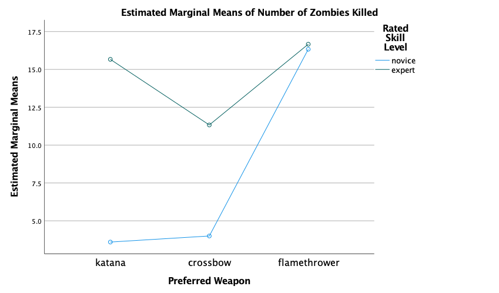

```{r setup, include=FALSE}
knitr::opts_chunk$set(echo = TRUE)
```

## Instructions

In a post-apocalyptic world overrun by zombies, a human factors psychologist was curious about the relative effectiveness of various weapons for killing zombies, but also suspected that skill level could be an important factor in zombie killing effectiveness. The human factors psychologist collected data from a sample of 20 survivors. The survivors were asked, "what is your preferred weapon for killing zombies?" Interestingly, there were only three categories (katana, crossbow, flamethrower). The researcher asked an independent weapons expert, who was unaware of the purpose of the study, to classify each survivor's skill level with the weapon (novice vs. expert). The dependent variable was the number of zombies killed with their preferred weapon since the beginning of the apocalypse.

You will analyze the data in parts (pun intended). Use SPSS and R.

## Import data

```{r}
# Import Packages
library(haven)
library(car)
library(emmeans)
library(lsr)
library(effects)
library(interactions)

# Import the .sav data file
Zombie.data <- read_sav("Data/Zombies.sav")

# Summarize Data
str(Zombie.data)
summary(Zombie.data)

```

Based on this summary, we know that this data frame contains `r dim(Zombie.data)[1]` rows and `r dim(Zombie.data)[2]` columns. The variables are *number*, *weapon*, and *skill*. Variables *weapon* and *skill* should be converted into factors.

## Convert Categorical Variables to Factors

```{r}
# Convert "weapon" and "skill" into factors.
Zombie.data$weapon <- factor(Zombie.data$weapon, labels = c("katana", "crossbow", "flamethrower"))
Zombie.data$skill <- factor(Zombie.data$skill, labels = c("novice", "expert"))

# Use effects coding, aka "deviation" coding, to code the factors
contrasts(Zombie.data$weapon) <- "contr.sum"
contrasts(Zombie.data$skill) <- "contr.sum"
contrasts(Zombie.data$weapon)
contrasts(Zombie.data$skill)
```

## Calculate Descriptive Statistics

```{r}
# Use the base R function "aggregate()" to calculate descriptive statistics by condition
aggregate(number ~ weapon + skill, data = Zombie.data, mean)
aggregate(number ~ weapon, data = Zombie.data, mean)
aggregate(number ~ skill, data = Zombie.data, mean)
```

## Conduct a two-way analysis of variance (ANOVA) in R

```{r}
# Use lm() to conduct a two-way ANOVA
Zombie.2way <- lm(number ~ weapon + skill + weapon:skill, Zombie.data)
summary(Zombie.2way)

# Use Anova() to obtain the Type III sum-of-squares
Anova(Zombie.2way, type=3)

# Check Homogeneity of Variance Assumption
leveneTest(number ~ weapon*skill, data = Zombie.data, center = mean)

# Understanding the Main Effect:
# a) Post Hoc comparisons to understand the main effect of "weapon"
emmeans(Zombie.2way, pairwise ~ weapon)

# b) Post Hoc comparisons to understand the main effect of "skill"
emmeans(Zombie.2way, pairwise ~ skill)

# Undertanding the Interaction Effect
# a) Interaction effect of "katana"
simple.katana <- lm(number ~ skill, data = Zombie.data, subset = weapon == "katana")
simple.katana

# b) Interaction effect of "crossbow"
simple.crossbow <- lm(number ~ skill, data = Zombie.data, subset = weapon == "crossbow")
simple.crossbow 

# c) Interaction effect of "flamethrower"
simple.flamethrower <- lm(number ~ skill, data = Zombie.data, subset = weapon == "flamethrower")
simple.flamethrower 

# Determine the Effect Size
etaSquared(Zombie.2way)

# Plot Data
plot(Effect(c('weapon', 'skill'), Zombie.2way), 
    xlab = 'weapon', 
    main = 'Interaction between Weapon & Skill',
    lines = list(multiline=TRUE), ylim = c(1, 25))
```

## Conduct a two-way analysis of variance (ANOVA) in SPSS

See full SPSS export in *Module_11_SPSS_aschles.pdf*. See Figure 1 for SPSS plot.

## Summary of Results

To determine whether the type of weapon and skill level had impacts on the number of zombies killed, we conducted a two-way analysis of variance. Number of zombies killed was the dependent variable, whereas type of weapon (with three levels) and skill level (with two levels) were the independent variables.

**1.) Determine whether there is an effect of skill level on the dependent variable. If there is, remember that you should report an effect size and describe the results. Assume** $\alpha$ **= .05.**

The main effect of skill level is statistically significant, *F*(1) = 20.59, *p* \< .001. In addition, the effect size ($\eta^2$ = .595) indicated that 59.50% of the variance in number of zombie deaths can be explained by level of skill.

**2.) Determine whether there is an effect of type of weapon on the dependent variable. If there is, remember that you should report an effect size and conduct post hoc analyses to better understand where the statistically significant differences are. Assume** $\alpha$ **= .05.**

The main effect of weapon type is statistically significant, *F*(2) = 12.92, *p* \< .001. In addition, the effect size ($\eta^2$ = .649) indicated that 64.90% of the variance in number of zombie deaths can be explained by the type of weapon used.

Because type of weapon was found to be related to number of zombies killed, post hoc analyses were conducted using LSD. Based on this procedure, a flamethrower produced significantly more zombie deaths than a crossbow (*MD* = 8.83, *SD* = 1.84, p < .001). A flamethrower also caused more zombie deaths than a katana (*MD* = 8.38, *SD* = 1.72, p < .001). There was no significant difference in zombie deaths between a katana and a crossbow. 

**3.) Is there an interaction between skill level and type of weapon? Report any statistically significant effects and be sure to clearly describe what you found. Assume** $\alpha$ **= .05.**

The main effect of the interaction between skill level and type of weapon is statistically significant, *F*(2) = 5.67, *p* = .016. In addition, the effect size ($\eta^2$ = .448) indicated that 44.80% of the variance in number of zombie deaths can be explained by the interaction between skill level and type of weapon. 


